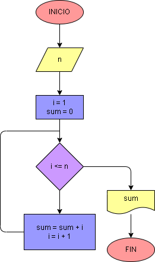

# Ejercicio No. 24: Suma de los n primeros números naturales 2

Para este ejercicio se desea que el usuario ingrese un número entero y se haga la suma de todos los números hasta el valor n que ingresó el usuario. Para esto se establecen dos variables, la primera llamada i, que inicia con un valor de 1, y la segunda llamada sum, que inicia en 0. Después se establece el ciclo while en el que se indica que: 

mientras que i sea menor o igual que n, se le sumará a sum el valor de i y a la variable i se le aumentará en 1 su valor, en ese mismo orden.

Finalmente, cuando i sea mayor que n, el bucle terminará y se imprimirá la suma de los números.

