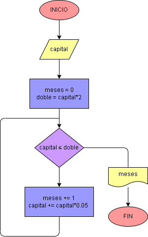

# Ejercicio No. 25: Interés compuesto.

En este ejercicio se busca calcular en cuántos meses se duplica el capital ingresado por el usuario, que es la variable capital. Se crean otras dos variables, la primera llamada doble, que tendrá el doble del capital ingresado y la segunda llamada meses, cuyo valor inicial será cero. Hecho esto, se implementa el bucle while en el que se indica que:

Mientras la capital sea menor o igual que doble, se le sumará a la capital el 5% de su valor actual y a la variable meses se le adicionará 1.

Cuando capital sea mayor que la variable doble el ciclo terminará y se imprimirá la cantidad de meses que se tardó el capital en duplicarse.

