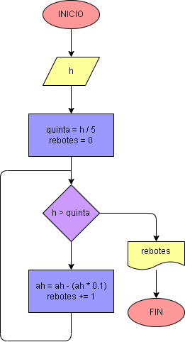

# Ejercicio No. 26: Rebotes de pelota.

Se le pide al usuario que introduzca la altura inicial de la pelota, en este caso h, y luego se establece una variable llamada rebotes que contará cuantos rebotes llega a dar la pelota. Entonces se implementa un bucle while en el que se indica que:

Mientras h sea mayor a la quinta parte de h, esta se irá decrementando en un 10% cada vez que la pelota rebote.

Cuando la condición ya no se cumpla, se imprimirá en cuál rebote la pelota no alcanza la quinta parte de la altura inicial.

