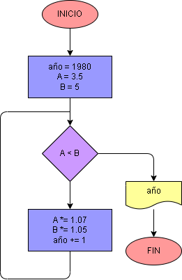

# Ejercicio No. 27: Crecimiento poblacional de ciudades.

Se declaran las variables año, A y B; que representan el año que inicia, la población inicial de la ciudad A y población inicial de la ciudad A, respectivamente. Luego se crea un bucle while tal que:

Mientras la población de la ciudad A sea menor que la población de la ciudad B, La cantidad de habitantes de cada ciudad aumentará según su rata de crecimiento a la variable año se le suma 1.

cuando deje de cumplirse la condición se imprimirá el año en el cual la ciudad A supera en población a la ciudad B.

