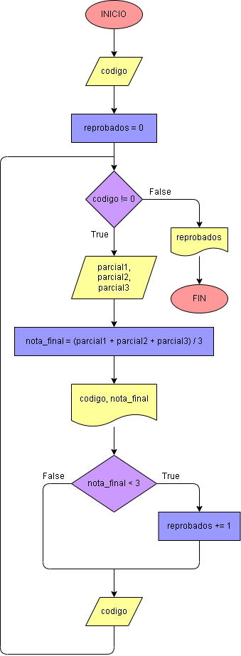

# Ejercicio No. 28: Registro centinela.

Primero, el usuario tiene que ingresar un código de estudiante que se guardará en la variable codigo, además se inicia una variable llamada reprobados que iniciará en cero. Ahora sí, se implementa un ciclo while tal que:

mientras que el código del estudiante sea diferente a 0, se le solicita al usuario la nota del primer, segundo y tercer parcial; Con esta información se calcula la nota final, que se guardará en nota_final, variable que inmediatamente se imprime en pantalla junto a codigo. Para contar a los estudiantes reprobados tenemos que, si la nota_final es menor que 3 se le suma 1 a reprobados, luego se le vuelve a pedir al usuario un código.

Este proceso se repetirá hasta que el usuario ingrese el registro centinela 0. ya terminado el proceso se imprime en pantalla la cantidad de alumnos reprobados.

