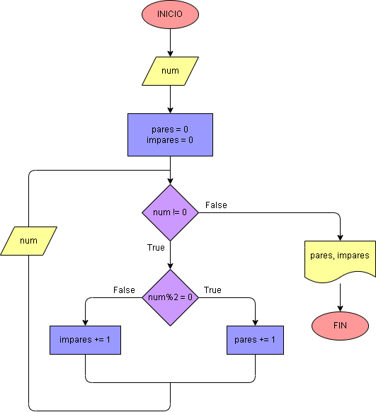

# Ejercicio No. 29: Registro centinela 2.

Para este ejercicio se necesitan tres variables, dos que hagan de contador de los números pares e impares, las cuales inician en cero, y otra que es el número natural que ingresa el usuario. De esta manera:

Mientras el número sea diferente de cero (número que será nuestro registro centinela) y dependiendo si el resultado es cero o no, se ira sumando en 1 a las variables contadoras. 

Este proceso continuara hasta que el usuario decida frenar el proceso con el número 0. terminado el proceso se imprimirá en pantalla el conteo de números pares e impares.

