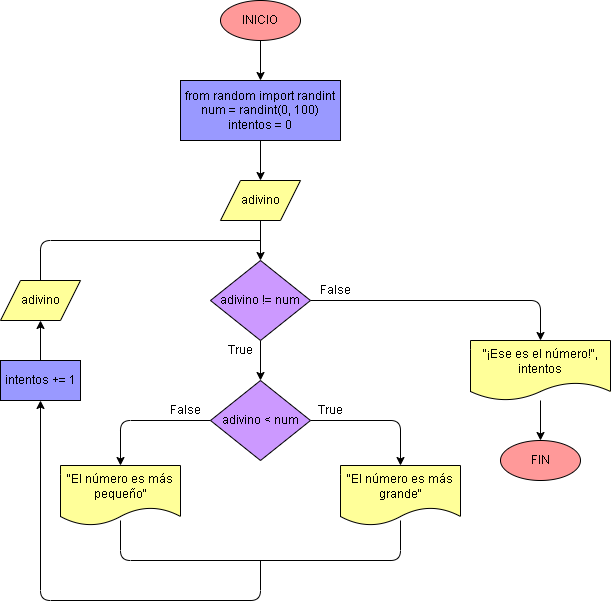

# Ejercicio No. 30: Adivinar un número.

Para empezar, de la librería random se importa randint, método que nos generará un número aleatorio que será almacenado en la variable num; luego, se pide al usuario que adivine el número y se almacena el valor que ingrese en la variable adivino, así mismo se crea la variable intentos que se encargará de contar los intentos que realice el usuario. A continuación, se usa un while para evaluar que:

Mientras el valor de adivino sea diferente al número aleatorio generado, el ciclo se repetirá. En cada ejecución, el usuario ingresará un número y se le informará si es más grande o pequeño que el número aleatorio generado.

Finalmente, cuando el usuario ingresa el número correcto, se le informa que ha adivinado el número y el número de intentos que ha realizado.

