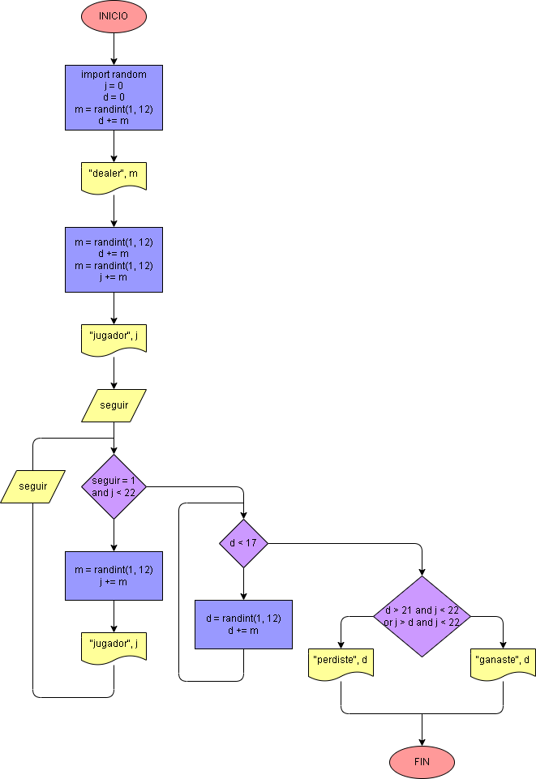

# Ejercicio No. 31: Veintiuno.

En este caso, nos decidimos por usar un mazo m de 12 cartas, esto lo logramos eligiendo en varias ocasiones un número aleatorio entre 1 y 12 y asignándolo a la variable. En el juego participan el jugador j y el dealer d. Al empezar, el dealer toma dos cartas, pero una de ellas se le muestra al jugador, mientras que el jugador sólo recibe una carta. Para continuar el juego, el usuario tiene que decidir (con 1 o 0) si va a seguir o plantarse, así entramos a un bucle en el que:

Mientras la variable seguir valga 1, el jugador recibirá una carta, la verá y decidirá si el ciclo se repite.

Cuando el jugador se plante, el dealer tomará cartas hasta tener al menos más de 17 puntos. Finalmente, por medio de una condición, se comparará cuál de los dos tuvo un valor más cercano al 21, pero descartará a quien supere este número.

