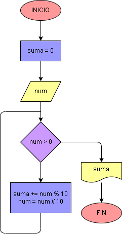

# Ejercicio No. 32: Sumar los dígitos de un número

Se solicita al usuario ingresar un numero num natural, que ingresa en un ciclo while; dentro de este ciclo se realiza la suma de los digitos que contiene num y se almacena en una variable suma. A continuación, se imprime el valor de suma.

