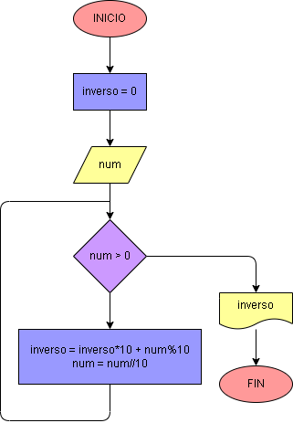

# Ejercicio No. 33: Número en orden inverso.

El usuario ingresa un número num positivo y luego se implementa un ciclo while; el bucle se ejecuta mientras num sea mayor a 0; dentro de este se realiza la operación: 
inverso = inverso*10 + num%10, en la que se van almacenando los dígitos del número ingresado en forma inversa; por último, se asigna a num = num//10, lo que permite que el número ingresado se vaya reduciendo en cada iteración del ciclo, hasta que num sea igual a 0.
Una vez acabado el ciclo, se imprime inverso.

