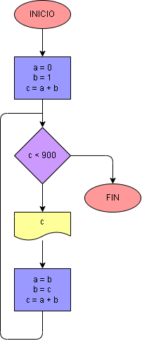

# Ejercicio No. 34: Serie Fibonacci.

En este ejercicio tendremos las variables a = 0, b = 1 y c = a + b, porque como dice el concepto de la serie, cada elemento es igual a la suma de los dos anteriores. En el procesamiento del programa se tendrá que usar un ciclo tal que:

Mientras c sea menor a 1000, se imprimirá c y, además, con cada repetición se hará un cambio de variable en el cual a = b y b = c, para seguir con la suma de los dos elementos anteriores.

