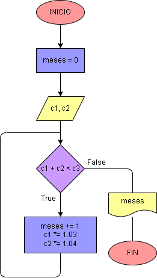

# Inversión para negocio

## Pedro tiene un capital de c1 pesos, y Juan uno de c2 pesos.  Uniendo los dos no les alcanza para hacer un negocio que requiere una inversión de c3 pesos.  Deciden colocar cada uno su capital a ganar interés.  Pedro lo colocó a un interés compuesto del 3% mensual, y Juan al 4% mensual.  Hacer el diagrama de flujo y el programa en Python que averigüe e imprima en cuántos meses, uniendo los dos capitales, pueden hacer el negocio que desean.

## Análisis:

Se reciben tres variables, el capital de Pedro (c1), el capital de Juan (c2) y el valor de la inversión para hacer el negocio (c3). A continuación se inicia el bucle while, para que se repita mientras la suma de los capitales de Juan y Pedro sea menor al valor del negocio. Cada vez que se repita el bucle, el contador de meses va aumentando en una unidad a la vez que al capital de Juan se le suma el 3% y al de Pedro, un 4%. Una vez terminado el bucle, se imprime la cantidad de meses que se necesitaron para cumplir la meta.

