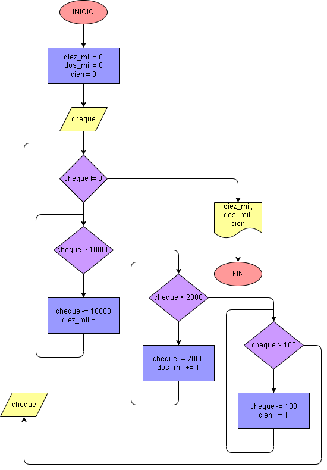

# Ejercicio No. 36: Cajero de banco.

Para este ejercicio se inician las variables para los billetes y monedas que se han entregado en el día en cero y se solicita al usuario a ingresar el valor del cheque, el cual debe ser múltiplo de 100 para que el cajero pueda funcionar correctamente. El cajero debe entregar un reporte diario de cuantos billetes entrega, por ende, se entra en un ciclo while tal que: 

Mientras el valor del cheque sea diferente a 0 (este será un registro centinela), el valor del cheque será revisado, primero para cuántos billetes de 10000 se entregarán, esto se hace restando el valor del cheque en 10000 y sumando uno a la variable diez_mil, hasta que el valor del cheque sea menor a 10000, este mismo proceso se repite para los billetes de 2000 y monedas de 100.

Una vez que se ingresa 0 como valor, las variables son imprimidas.

