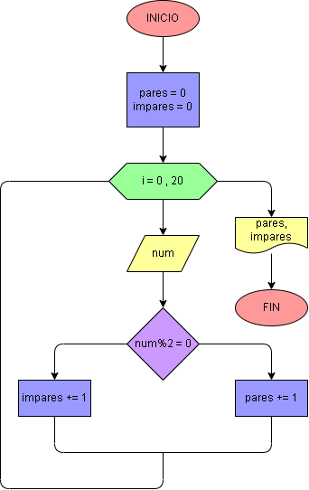

# Ejercicio No. 37: contador de pares e impares.

Para realizar este ejercicio se crean dos contadores, el de números pares y el de impares. Como necesitamos saber cuántos números pares e impares habrá en 20 entradas, se usará un ciclo for que se repetirá en un rango de 20 tal que:

Al ingresar al ciclo se le pedirá al usuario ingresar un número y con una condición se sabrá si es par o impar. De esta manera, se repetirá todo el proceso hasta que se completen las iteraciones. 

Al finalizar el ciclo, se imprimirá en pantalla cuantos números pares e impares se ingresaron.

