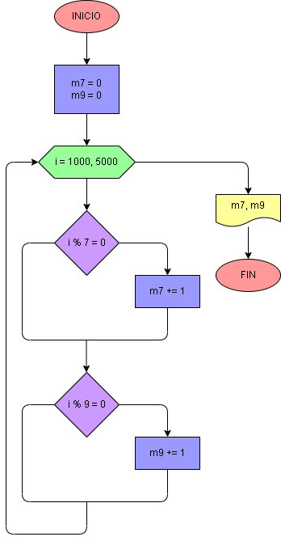

# Ejercicio No. 38: Múltiplos de 7 y 9 entre 1000 y 5000.

En este ejercicio se inicializan dos contadores en 0 de múltiplos de 7 y 9. Se implementa un ciclo for que recorre los números del 1000 al 5000 y en cada repetición verifica si el número iterado es múltiplo de 7 y/o 9. Si es múltiplo de 7, se añade 1 a m7 y si es múltiplo de 9, se añade 1 a m9. finalmente se imprimirán en pantalla los contadores de cada múltiplo.

