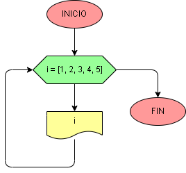

# Ejercicio No. 39: iterar lista.

En este ejercicio el ciclo for recorre una lista que contiene los números del 1 al 5 e imprime cada uno; cada vez que se imprime un número es una iteración, es decir, se llegan a hacer 5 iteraciones.

