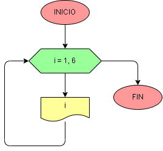

# Ejercicio No. 41: iterar en un rango.

Se puede utilizar el bucle for para iterar sobre una secuencia de números usando range(), función que trabaja desde el primer número hasta el último menos uno.

