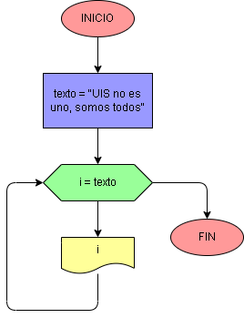

# Ejercicio No. 42: iterar cadena.

Además de iterar en una lista, se puede en una cadena de texto. De esta manera, se le asigna a una variable el texto y el ciclo for recorrerá cada letra o espacio en blanco, imprimiendo cada elemento. Al finalizar el bucle, se puede leer el mensaje verticalmente.

