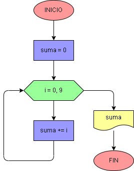

# Ejercicio No. 43: sumar con rango.

Para este ejercicio, se crea la variable suma, y en el ciclo for se toma con la función range() un rango de 10; por ende, empezará desde 0 y llegará hasta 9. Dentro del ciclo se hará el proceso de suma y cuando i sea 9 se terminará el proceso y se imprimirá en pantalla la suma total de los 9 primeros números enteros positivos, cuyo resultado es 45.

