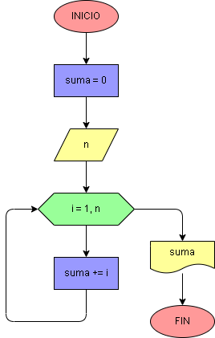

# Ejercicio No. 44: sumar con rango.

La variable suma inicia en 0 y se pide al usuario que ingrese un número n. En el ciclo for se toma con la función range() un rango de 1 hasta n+1. Dentro del ciclo se hará el proceso de suma y cuando i sea el número que el usuario ingresó, termina el proceso y se imprime en pantalla la suma consecutiva del 1 hasta el valor digitado.

