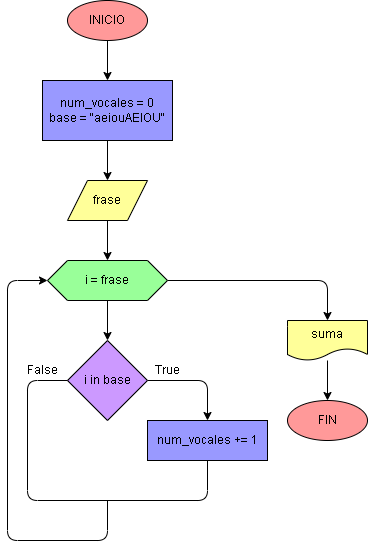

# Ejercicio No. 45: Contador de vocales.

Se le indica al usuario que ingrese una frase, esta se almacena en la variable frase. Se establece la variable base como una cadena de caracteres que contiene todas las vocales en mayúsculas y minúsculas. Luego, se establece la variable num_vocales como un contador iniciado en 0. El código itera a través de frase, y si encuentra una vocal que esté contenida en la base, aumentará num_vocales en 1. Finalmente, el código imprimirá el valor almacenado en num_vocales.

