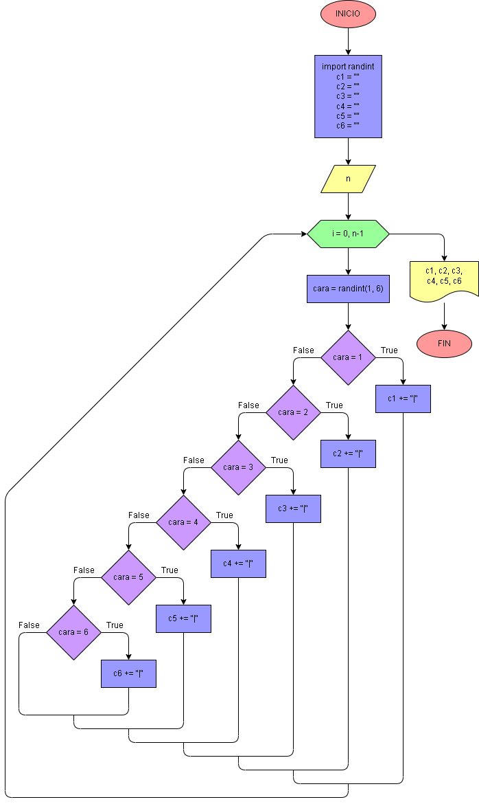

# Ejercicio No. 46: Dados.

Para este ejercicio se importa la función randint() de la librería random, se crean una variable por cada cara del dado y también se genera un input en el que el usuario decide el número n de veces que se lanzará el dado. Dentro del ciclo, se genera un número aleatorio entre 1 y 6, que simulará el valor del dado, y a partir de este número se le irán sumando símbolos a las variables correspondientes. Posteriormente, se imprimirán, a semejanza de una barra, las repeticiones de cada número.

