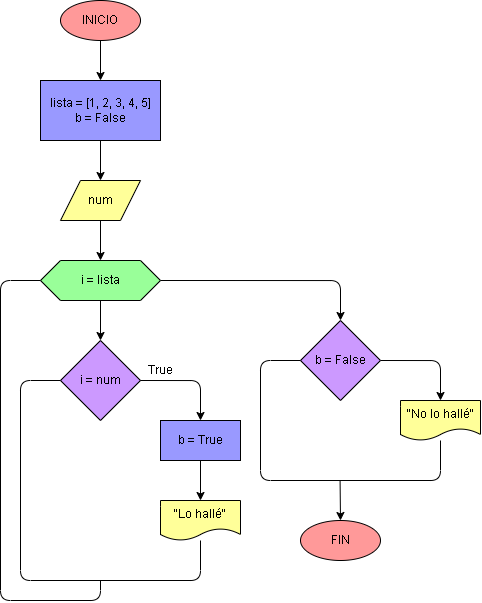

# Ejercicio No. 48: Buscar número en conjunto.

Se pide al usuario que ingrese un número que se asigna a la variable num, se crea una lista con los elementos 1, 2, 3, 4 y 5; y una bandera b = False, luego, en un ciclo for:

Para determinar si num está en lista, se usa un condicional en el que sí i es igual al num, se imprime un mensaje diciendo que se encontró y la bandera se vuelve True. 

Al salir del bucle, si b se mantuvo intacta, se imprime un mensaje diciendo que no se encontró.

