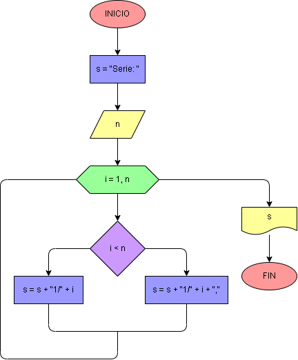

# Ejercicio No. 50: Secuencia de fracciones.

El usuario ingresa un número n y en la variable s se almacena la cadena “Serie: ”. A través de un ciclo for, que va desde 1 hasta n, se irán almacenando los términos de la serie, que son 1 como numerador e i como denominador, concatenándolos en s y separándolos por una coma. En la última iteración, la cadena de s finaliza sin coma y al finalizar se imprime s, es decir, todos los términos de la serie.

