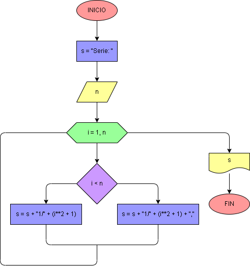

# Ejercicio No 52: secuencia de fracciones 2.

Se le solicita un número n al usuario y con la variable s se almacena “Serie: ”. Después, con un ciclo for itera en un rango de 1 hasta el número ingresado. Dentro del ciclo, si i es menor al número ingresado, se agrega a la serie 1 como numerador, y como denominador i² +1, seguido de una coma. Cuando se deja de cumplir la condición se agrega el último elemento de la secuencia sin la coma. Finalmente, se imprime en pantalla la variable s.

