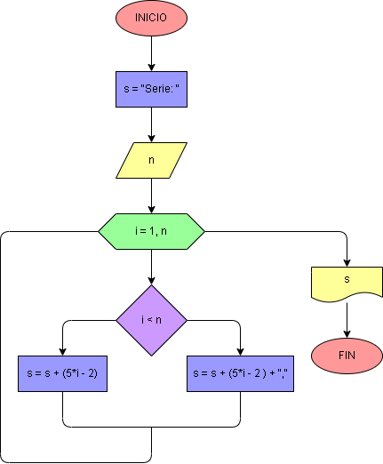

# Ejercicio No. 54: Secuencia de 5 en 5.

Se le pide al usuario digitar un número natural n y en la variable s se almacena la cadena “Serie: ”. Posteriormente, con un ciclo for que itera en un rango desde 1 hasta el n tenemos que:

En cada iteración, si i es menor que n, se concatena el resultado de la operación 5*i – 2 y es agregado a s, separando cada uno con una coma. Al llegar al último término, cuando i sea igual a n, la cadena de s tiene que finalizar sin coma. 

Al finalizar se imprime s, con todos los términos de la serie.

