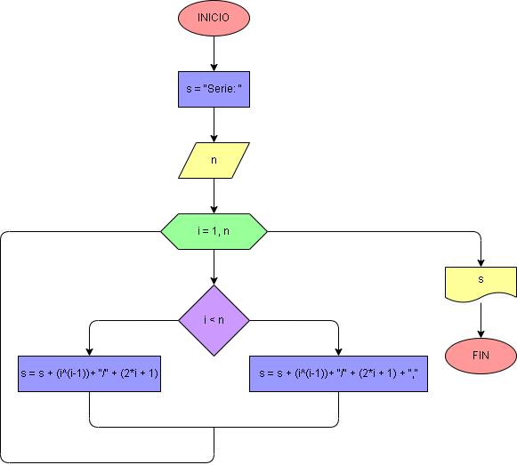

# Ejercicio No. 55: Secuencia de fracciones 3.

Se le pide al usuario digitar n, mientras que s almacenará “Serie: ”. Se utiliza un bucle for para iterar desde 1 a n, y dentro del bucle se calcula el término de la serie y se concatena dentro de s. Si i es menor que n, se calcula i^(i -1) en el numerador y 2* i +1 en el denominador, con una coma después del término; De lo contrario, se hace lo mismo pero no se agrega ninguna coma. Finalmente, se imprime s.

